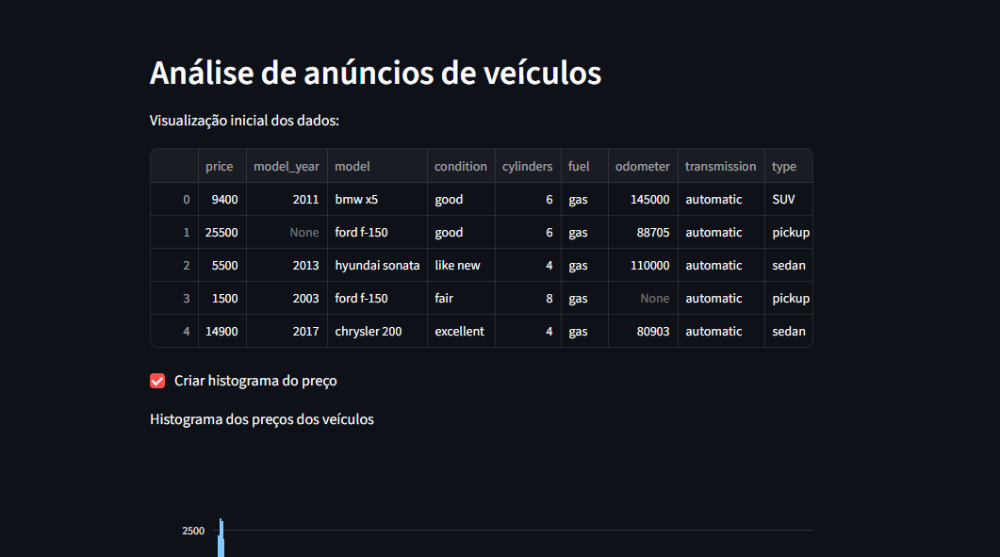
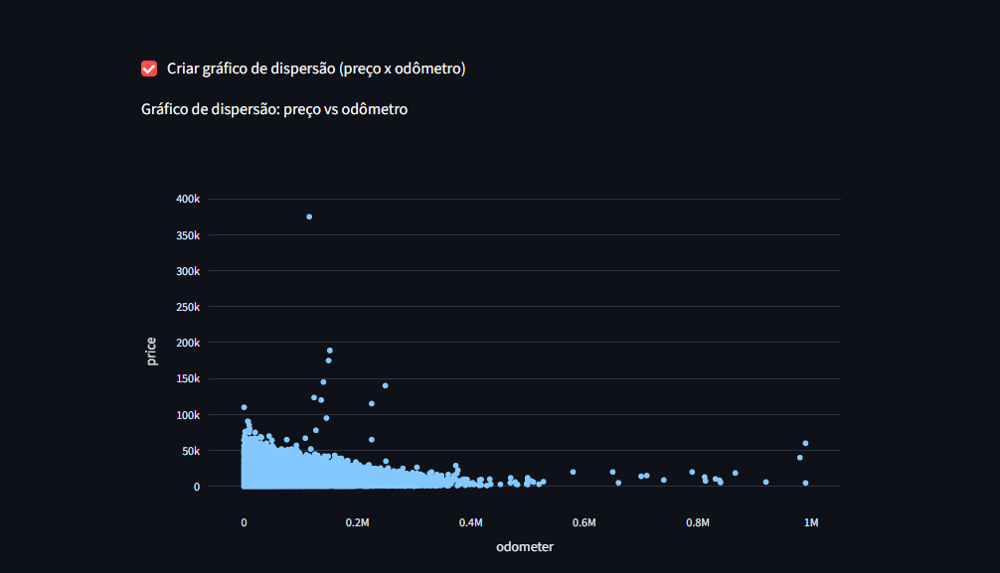

## 🚗 Dashboard Interativo — Anúncios de Veículos Usados

## 📌 Visão Geral
Este projeto apresenta o desenvolvimento de um dashboard interativo em Streamlit para análise exploratória de anúncios de veículos usados nos Estados Unidos.

O objetivo é transformar dados brutos em visualizações acessíveis, permitindo a exploração de padrões iniciais de mercado por meio de uma aplicação web pública, simulando um cenário real de entrega de produto analítico.

---

## 📸 Visualização do Aplicativo

**Visão geral do dashboard**

**Gráfico de dispersão — Preço vs Quilometragem**

---

## 🎯 Objetivo do Projeto
- Desenvolver um aplicativo web interativo para exploração de dados  
- Analisar a distribuição de preços e quilometragem de veículos usados  
- Avaliar visualmente a relação entre preço e odômetro  
- Aplicar boas práticas de desenvolvimento e deploy de aplicações de dados  

---

## 🗂️ Dados Utilizados
- Dataset: `vehicles_us.csv`  
- Tipo: anúncios de veículos usados  
- Escopo: dados públicos utilizados em estudo de caso educacional  

Principais variáveis:
- `price` — preço do veículo  
- `odometer` — quilometragem  
- `model_year` — ano do modelo  
- `condition` — condição do veículo  
- `fuel`, `transmission`, `type` — características adicionais  

---

## 🛠️ Tecnologias Utilizadas
- Python  
- Pandas  
- Plotly Express  
- Streamlit  
- Jupyter Notebook  
- Git & GitHub  
- Render (deploy em nuvem)  

---

## 🔍 Metodologia
- Análise exploratória inicial dos dados em Jupyter Notebook  
- Preparação básica dos dados para visualização  
- Desenvolvimento do dashboard interativo com Streamlit  
- Implementação de gráficos interativos:
  - Histograma de distribuição de preços  
  - Gráfico de dispersão entre preço e quilometragem  
- Implantação do aplicativo em ambiente de nuvem  

📌 O foco do projeto é interatividade e visualização exploratória, não modelagem preditiva.

---

## 📊 Funcionalidades do Aplicativo
O dashboard permite:
- Explorar a distribuição de preços dos veículos  
- Analisar a relação entre preço e quilometragem  
- Interagir com visualizações por meio de caixas de seleção  
- Acessar a análise diretamente pelo navegador, sem necessidade de código  

---

## 🌐 Aplicação Online
O aplicativo está disponível publicamente no link abaixo:

👉 https://sprint5-streamlit.onrender.com/

> Observação: por estar hospedado em plano gratuito, o aplicativo pode levar alguns segundos para carregar após períodos de inatividade.

---

## 📂 Estrutura do Repositório
sprint_streamlit
├── app.py
├── vehicles_us.csv
├── requirements.txt
├── README.md
├── images
│ ├── dashboard_app.png
│ └── scatter_price_odometer.png
├── notebooks
│ └── EDA.ipynb
└── .streamlit
└── config.toml

---

## ✅ Status
Projeto concluído e implantado, com foco em visualização de dados, interatividade e entrega de aplicação analítica em produção.

---

## 👩‍💻 Autora
**Denise Duarte**  
Analista de Dados Júnior | Python | SQL | Visualização de Dados  
📬 Aberta a oportunidades na área de Dados
