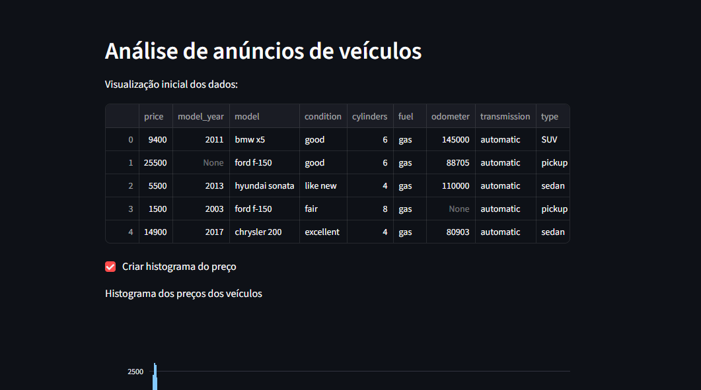
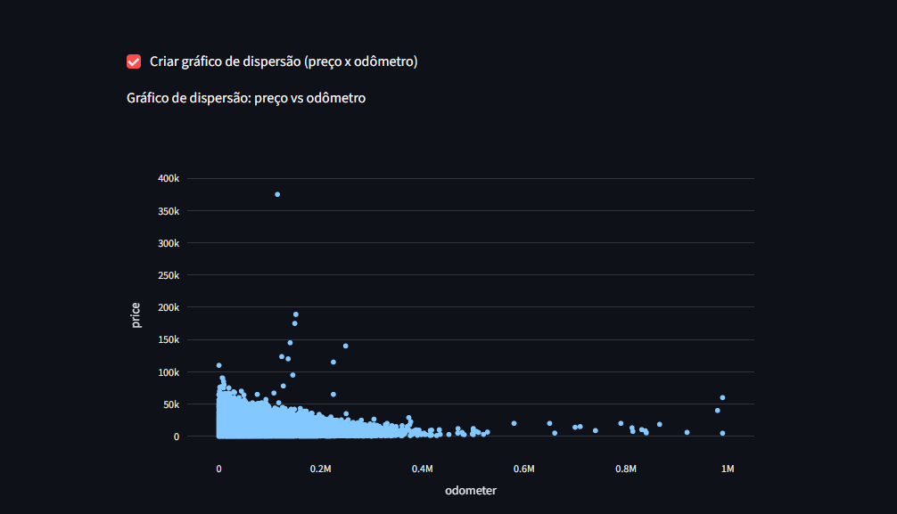

# Dashboard Interativo de Veículos Usados

## Visão geral

Este projeto apresenta uma aplicação web desenvolvida com Streamlit para exploração de anúncios de veículos usados nos Estados Unidos.

O dashboard transforma os dados dos anúncios em visualizações interativas, permitindo analisar a distribuição dos preços e a relação entre preço e quilometragem diretamente pelo navegador.

## Aplicação on-line

A aplicação está disponível em:

[**Acessar o dashboard de veículos usados**](https://sprint5-streamlit.onrender.com/)

> A aplicação utiliza hospedagem gratuita e pode levar alguns segundos para iniciar após períodos de inatividade.

## Visualização do aplicativo

### Visão geral



### Preço e quilometragem



## Objetivos

- Desenvolver uma aplicação web interativa com Streamlit.
- Tornar a análise acessível sem a necessidade de executar código.
- Explorar a distribuição dos preços dos veículos.
- Analisar visualmente a relação entre preço e quilometragem.
- Disponibilizar a aplicação em ambiente de nuvem.
- Demonstrar uma entrega completa, do código ao deploy.

## Dados analisados

O conjunto `vehicles_us.csv` contém **51.525 anúncios** e **13 variáveis** relacionadas a veículos usados.

As principais informações disponíveis são:

| Variável | Descrição |
|---|---|
| `price` | Preço anunciado |
| `model_year` | Ano do modelo |
| `model` | Modelo do veículo |
| `condition` | Condição declarada |
| `cylinders` | Quantidade de cilindros |
| `fuel` | Tipo de combustível |
| `odometer` | Quilometragem |
| `transmission` | Tipo de transmissão |
| `type` | Categoria do veículo |
| `paint_color` | Cor |
| `is_4wd` | Indicação de tração 4x4 |
| `date_posted` | Data de publicação |
| `days_listed` | Tempo de permanência do anúncio |

## Funcionalidades

A aplicação permite:

- visualizar uma amostra inicial dos dados;
- gerar um histograma interativo dos preços;
- gerar um gráfico de dispersão entre quilometragem e preço;
- ativar ou ocultar cada visualização por meio de caixas de seleção;
- explorar os gráficos com os recursos interativos do Plotly.

## Visualizações

### Distribuição dos preços

O histograma permite observar como os preços anunciados se distribuem e identificar a presença de valores extremos.

### Relação entre preço e quilometragem

O gráfico de dispersão permite explorar visualmente a relação entre o valor anunciado e a quilometragem registrada.

## Desenvolvimento

O projeto foi desenvolvido em quatro etapas:

1. exploração inicial dos dados em Jupyter Notebook;
2. preparação da estrutura da aplicação;
3. criação das visualizações interativas;
4. configuração e publicação em ambiente de nuvem.

## Tecnologias utilizadas

- Python
- Pandas
- Plotly
- Streamlit
- Jupyter Notebook
- Git e GitHub
- Render

## Limitações

- A aplicação possui foco exploratório e não realiza previsões de preço.
- Os gráficos utilizam os dados disponíveis sem modelagem estatística.
- A base contém valores ausentes em algumas variáveis.
- Valores extremos podem influenciar a escala das visualizações.
- As relações observadas nos gráficos não representam necessariamente causalidade.
- A versão atual não possui filtros por modelo, ano, condição ou tipo de veículo.

## Possíveis melhorias

- Adicionar filtros por tipo, modelo, ano e condição.
- Criar indicadores resumidos de preço e quilometragem.
- Permitir comparação entre categorias de veículos.
- Aplicar tratamento específico para valores ausentes e extremos.
- Adicionar novas visualizações e análises segmentadas.

## Estrutura do repositório

```text
streamlit-vehicle-dashboard/
├── data/
│   └── vehicles_us.csv
├── images/
│   ├── dashboard_app.png
│   └── scatter_price_odometer.png
├── notebooks/
│   └── EDA.ipynb
├── .streamlit/
│   └── config.toml
├── app.py
├── .gitignore
├── README.md
└── requirements.txt
```

## Como executar localmente

1. Clone o repositório:

```bash
git clone https://github.com/denise-analytics/streamlit-vehicle-dashboard.git
```

2. Acesse a pasta:

```bash
cd streamlit-vehicle-dashboard
```

3. Instale as dependências:

```bash
pip install -r requirements.txt
```

4. Inicie a aplicação:

```bash
streamlit run app.py
```

5. Abra no navegador o endereço informado pelo Streamlit.

## Arquivos principais

- [Aplicação Streamlit](app.py)
- [Notebook de análise exploratória](notebooks/EDA.ipynb)
- [Base de anúncios](data/vehicles_us.csv)

## Autora

**Denise Duarte**  
Analista de Dados Júnior | Python | SQL | Excel | Power BI